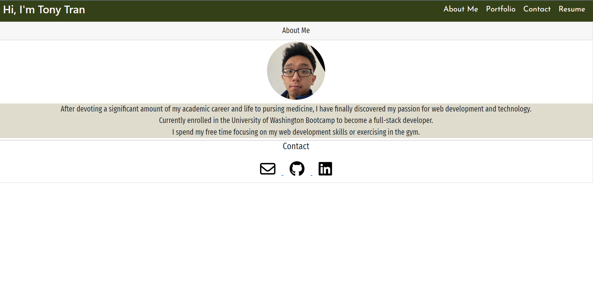

# Portfolio 2.0

## Description

---

Hey, my name is Tony Tran!

I recently decided on a career switch from healthcare over to becoming a web developer. After devoting a significant amount of my academic career and life to pursing medicine, I have finally discovered my passion for web development and technology. I look forward to creating new projects and learning more about what this field has to offer. This new version of my portfolio was built using React. 

## Table of Contents

---
- [Preview](#preview)
- [Technology](#technology)
- [Portfolio](#portfolio)
- [Authors](#authors)

## Preview 

---

## Technology

---

Technology used to build the application:

    - Javascript
    - Node.js
    - JSX
    - React 
    - Bootstrap

## Portfolio

---

Portfolio deployed to GitHub Pages is available [here](https://tonytran97.github.io/portfolio-2.0/).

## Authors

---

- Tony Tran
  - [GitHub](https://github.com/tonytran97)
  - [LinkedIn](https://www.linkedin.com/in/tony-tran-2b8aa4242/)
